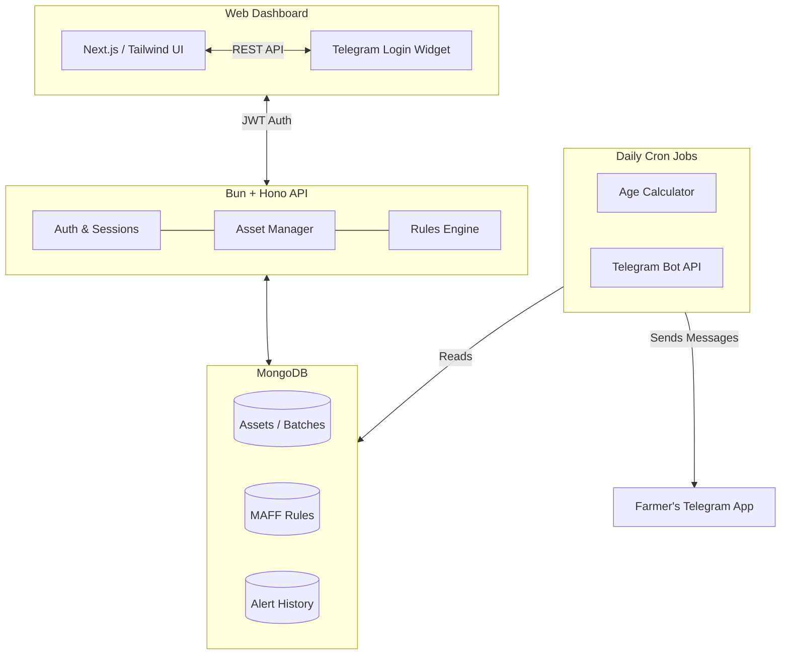

# VKasekor: Master Plan & System Overview

> [!abstract] Executive Summary
> **VKasekor** (Farmer Helper) is a digital agricultural assistant designed to modernize farming in Cambodia. It bridges the gap between official agricultural guidelines (MAFF) and daily farm operations by providing an automated, scheduled alert system delivered directly to farmers via Telegram.

---

## 1. The Core Problem & Solution

### The Problem
Farmers often lack access to, or struggle to strictly follow, scientific agricultural schedules. Missing a critical vaccination window or feeding the wrong nutritional mix (e.g., giving high-protein starter feed to mature birds) leads to high mortality rates and low yields.

### The Solution
A "set-and-forget" digital assistant. A farmer registers a new batch of assets (e.g., 500 chickens, 10 beds of cucumbers) on day one. From that point forward, the system automatically acts as their agricultural expert, sending daily Khmer-language instructions via Telegram detailing exactly what needs to be done that day.

---

## 2. The "Rules Engine" (The Secret Sauce)

> [!info] For Software Engineers
> You do not need to be an agriculture expert to maintain this system. The domain knowledge is completely abstracted from the code.

The core of VKasekor is a **Rules Engine**. Agriculture operates on predictable timelines. We model this by attaching a `day_offset` to specific instructions.

*   **Day 0**: Prepare environment (Heat lamps, Starter Feed).
*   **Day 7**: First Vaccination (Newcastle).
*   **Day 21**: Transition to Grower Feed (Lower protein, higher energy).
*   **Day 60**: Harvest.

**How it works programmatically:**
When a user wants to "check the food status", the system calculates `Age = Today - Arrival Date`. It then queries the database for the rule where `day_offset == Age`. The code simply executes the rule; it doesn't need to know *why* the feed changed.

This makes the system infinitely scalable. Adding support for "Pigs" or "Cucumbers" requires **zero changes to the core engine logic**—we simply seed new rules into the database.

---

## 3. High-Level Architecture

### Components:
1.  **Web Dashboard**: The management interface where farmers register batches, edit quantities (e.g., if mortality occurs), and view their timeline.
2.  **Hono API (Backend)**: Fast, lightweight routing connecting the frontend to the database.
3.  **Cron Automation**: The heartbeat of the system. Runs daily at 07:00 AM (ICT), calculates the age of all active assets, matches them with rules, and fires alerts.
4.  **Telegram Bot**: The primary delivery mechanism. Chosen because it requires zero app installations and is widely used in Cambodia.

---

## 4. Multi-Asset Configuration

The system is designed to support a polyculture farm (multiple types of animals/crops at once). 
This is handled via a central `AssetConfig` that maps metadata dynamically:

| Asset Type | Khmer Name | Unit | Emoji | Harvest Time |
| :--- | :--- | :--- | :--- | :--- |
| **Chicken** | មាន់ | ក្បាល (Heads) | 🐔 | 60 Days |
| **Pig** | ជ្រូក | ក្បាល (Heads) | 🐖 | 180 Days |
| **Cucumber** | ត្រសក់ | រង (Beds) | 🥒 | 45 Days |

---

## 5. Future Roadmap & Monetization Potential

> [!success] Phase 1: Adoption & Retention (Current)
> Focus on providing massive free value. Help farmers increase yields and reduce mortality rates through the free Telegram alerts.

> [!example] Phase 2: Marketplace Integration
> If the system knows a farmer has 500 chickens that are 18 days old, the system *knows* they will need "Grower Feed" in exactly 3 days. We can integrate e-commerce to offer direct delivery of the exact feed they need, precisely when they need it.

> [!example] Phase 3: Analytics & Traceability
> Aggregated data on survival rates across different regions. Providing consumers with "Farm-to-Table" traceability (scanning a QR code on meat to see the exact vaccination and feeding history from the system).
