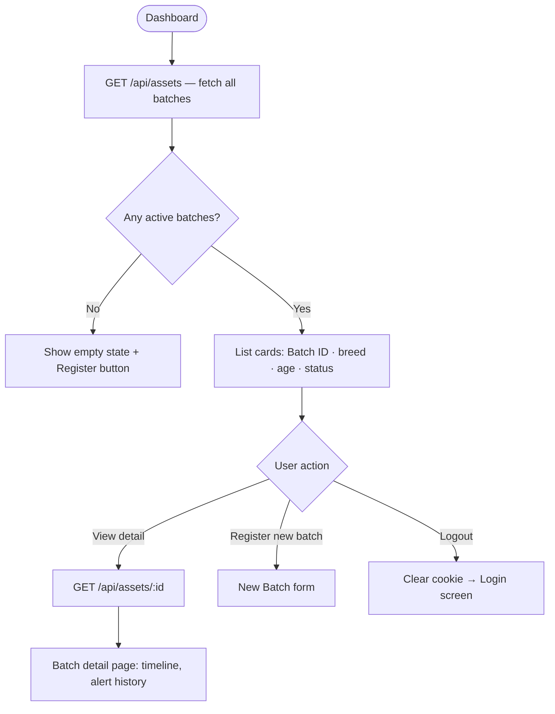
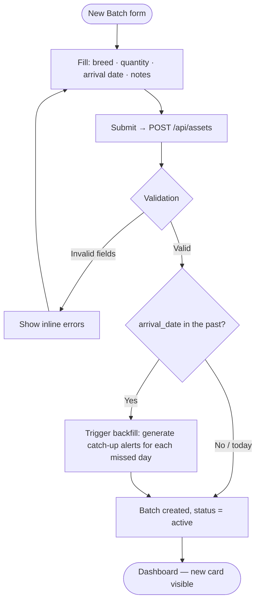
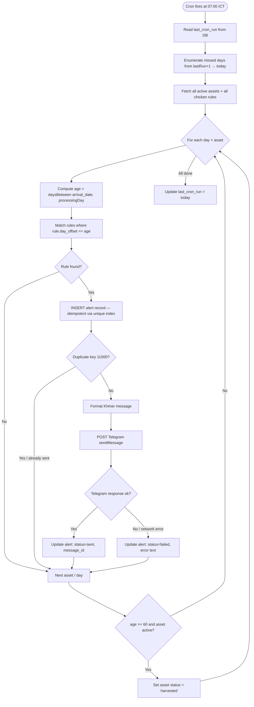
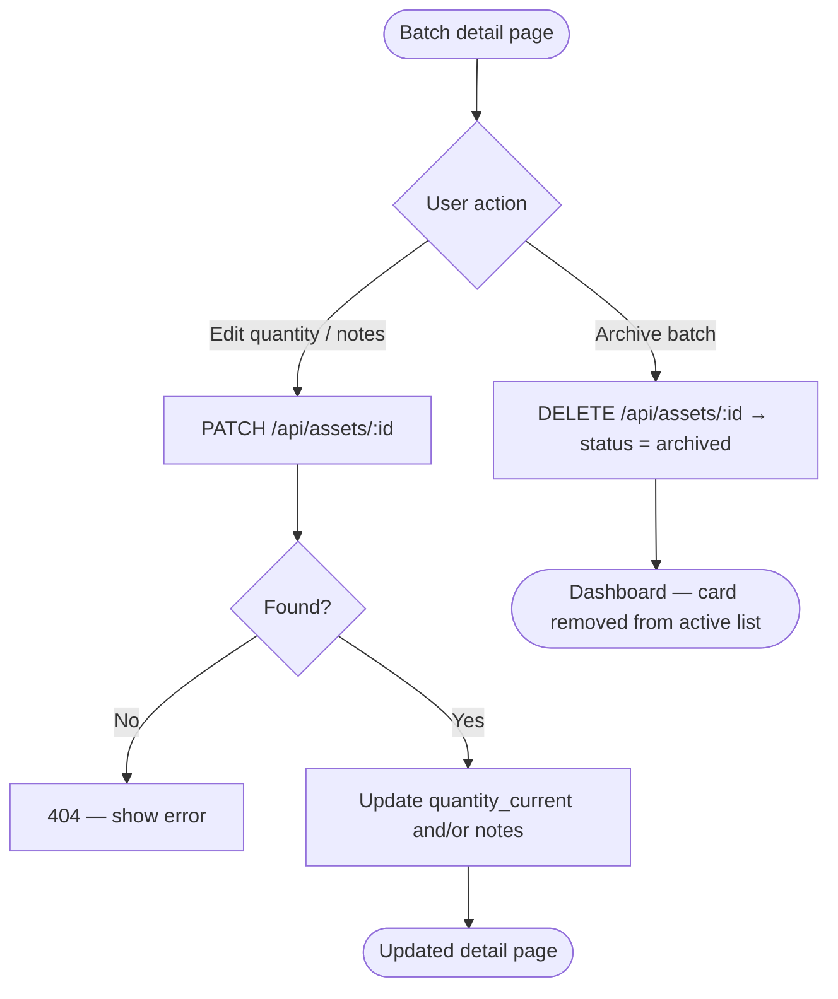
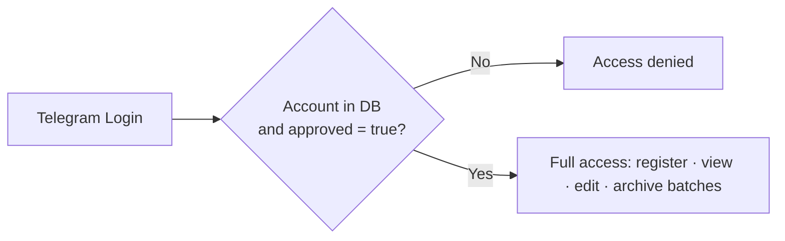

# User Flow — Kasekor Helper

## Authentication Flow

```mermaid
flowchart TD
    A([User visits website]) --> B[Landing page / Login screen]
    B --> C[Click "Login with Telegram"]
    C --> D[Telegram Login Widget popup]
    D --> E{User authorises?}
    E -- No --> B
    E -- Yes --> F[Browser receives signed payload]
    F --> G[POST /api/auth/login with payload]
    G --> H{Backend verifies HMAC signature}
    H -- Invalid / expired --> I[401 — show error message]
    I --> B
    H -- Valid --> J[Look up User in DB]
    J --> K{Account approved?}
    K -- No --> L[403 — Access denied]
    L --> B
    K -- Yes --> M[Update last_login, issue JWT in HTTP-only cookie]
    M --> N([Redirect to Dashboard])
```

---

## Dashboard — Batch Overview



---

## Register New Batch



---

## Daily Alert Engine (automated, no UI)



---

## Edit Batch



---

## Access Control


